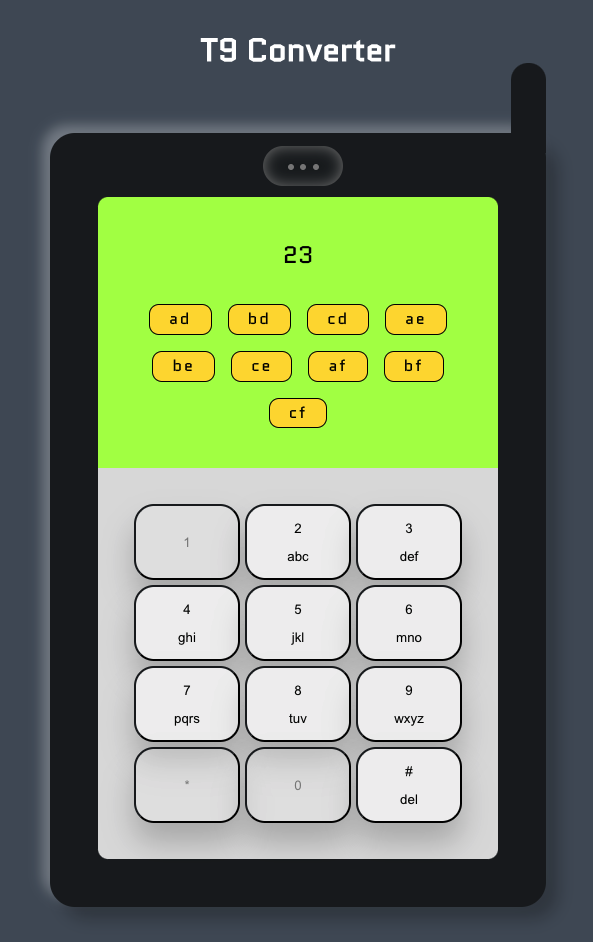

# T9 Converter

A number to word list converter with a NodeJS backend and React frontend.

## Task:

The backend should provide an endpoint that converts a given numeric
string into a list of corresponding words in the style of T9
[https://en.wikipedia.org/wiki/T9_(predictive_text)] For example, given the input 23
the output should be: ad, ae, af, bd, be, bf, cd, ce, cf
<br>  
<br>


# Getting started

Make sure you have nodejs and npm installed before continuing.

First make a copy of the repo locally:

```
git clone https://github.com/stefi23/t9-converter.git
```

Then start the server inside the t9-converter folder run:

```
$ npm install
$ npm start
```

After you've started the server/BE you should also start the FE to see the app. In a new terminal window in the t9-converter do the following:

```
$ cd client
$ npm install
$ npm start
```

It should open the app at [http://localhost:3000/](http://localhost:3000/)

The server is available at [http://localhost:9000/](http://localhost:9000/)
